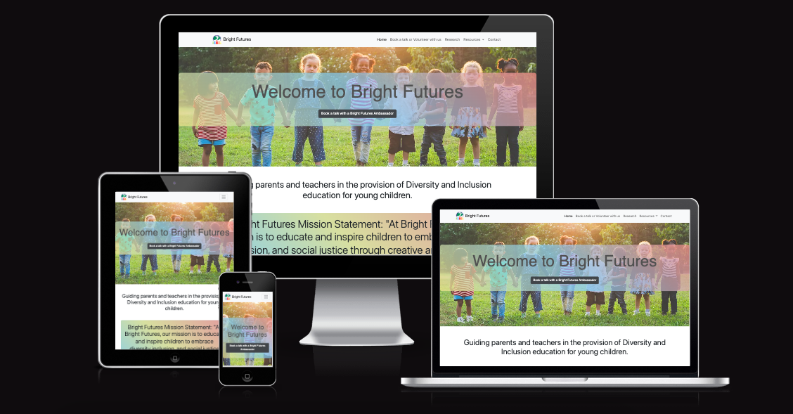
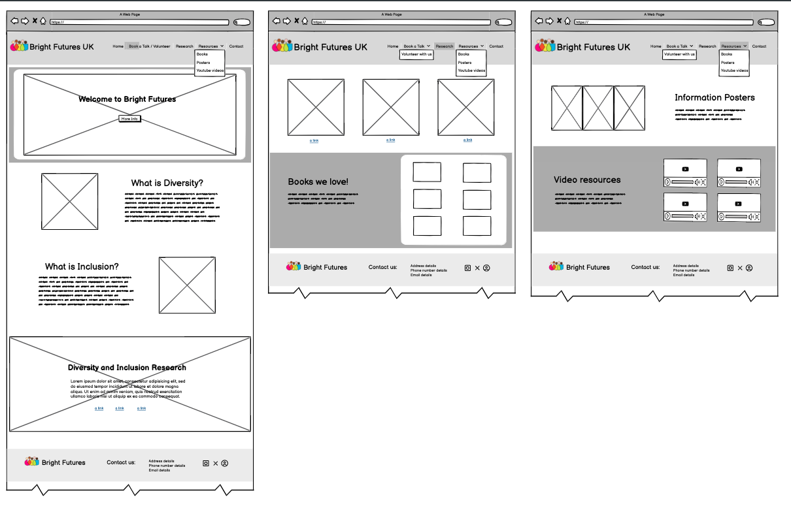

# Bright Futures

  

| <a href="https://gerbil1511.github.io/BrightFuturesProject/index.html" target="_blank">Live Project</a> |

## Introduction 

For my first individual formative HTML, CSS & Bootstrap assignment for the Code Institute AI Augmented FullStack Bootcamp, I created a project based upon the goals and features proposed in Project 1: "Diversity & Inclusion". Inspired by my real life experience of having a sibling with physical disabilities (Spina Biffida and Hydrocephalus), and how in their early years it was very apparent that he experieinced some barriers to inclusion which may have had an impact on his world view/attitude and personal development. My aim was to create a website that supports parent and educators/teachers in guiding and empowering younger generations in fostering a more compassionate and empathetic view ensuring all people are welcome and feel they belong.

Live project: <a href="https://gerbil1511.github.io/BrightFuturesProject/index.html" target="_blank">Bright Futures</a>

<h2 align="center" id="TOC">Table of Contents</h2>

* [Bright Futures](#bright-futures)
  - [Introduction](#introduction)
  - [Table of Contents](#TOC)
  - [Project Ouline](#project-outline)
* [Project Planning](#project-planning)
    - [UX Design](#ux-design)
      - [Strategy](#strategy)
        - [User Stories](#user-stories)
      - [Scope](#scope)
        - [Features](#features)
            - [Navigation, Links and Hero Section](#navigation-links-and-hero-section)
            - [Bootstrap Cards](#bootstrap-grid-cards)
            - [Book a talk/Volunteer](#book-a-talk-volunteer)
            - [Footer](#footer)
      - [Structure](#structure)
        - 
      - [Skeleton](#skeleton)
        - [Wireframes](#wireframes)
      - [Surface](#surface)        
        - [Colours](#colours)
        - [Fonts](#fonts)
        - [Images](#images)
        - [Resnposive Design](#responsive-design) 
* [Built With](#built-with)
  - [Technology and Languages](#technologies-and-languages)
  - [Libraries and Frameworks](#libraries-and-frameworks)
  - [Tools & Programs](#tools-and-programs)
* [Development](#deployment)
* [Testing](#testing)
* [Credits](#credits)
  - [Code](#code)
  - [Content Research](#content-research)
  - [Media](#media)
  - [Acknowledgements](#acknowledgements)

<a href="#bright-futures">Back To Top</a>

## Project Outline

Bright Futures is a fictional organisation dedicated to providing parents and teachers with resources and information to support their conversations around diveristy and inclusion to children of primary school age. The webpage developed for this organisation provides clear and concise basic concepts, details about the organisation's mission statement, testimonials/reviews, a variety of resources and links to further research, contact details, plus an oppotunity to book a talk with a Bright Future's Diversity and Inclusion ambassador or to volunteer to become one. The webpage is well-designed and easy-to-navigate, appealing, responsive across multiple devices and adheres to accessibility standards.

## UX Design

The following details are based upon the 5 planes of user experience (UX). The five planes of user experience (UX) are a framework for UX design that are stacked on top of each other, from abstract to concrete and credited to be developed by Jesse James Garrett, author of The Elements of User Experience.  

### Strategy: The most abstract plane, where you balance business objectives with user needs. This is where you determine long-term and short-term goals, and what users will want from the product in the form of User Stories. 
Business Goals:</u>
- Increase bookings for ambassador talks.
- Encourage community volunteer sign-ups.
- Provide valuable resources on diversity and inclusivity.
- Provide a clear mission statement emphasizing the importance of teaching diversity and inclusion to young children.

User Needs:
- Easy access to resources and activities.
- Clear information on booking ambassadors and volunteering.
- Engaging content that supports learning about diversity and inclusivity.

User Personas:
- Parents seeking educational resources for their children.
- Teachers looking for classroom materials and guest speakers.
- Community members interested in volunteering.

Competitor Analysis:
- The website differentiates itself from other resources by offering interactive talks and a community of ambassadors. For example, highlighting the unique approach of using stories, games, and activities in the talks.
 
 

User Stories: 

| #  | User Story                                                                                                                                            |
|----|-------------------------------------------------------------------------------------------------------------------------------------------------------|
| 1  | As a PARENT/TEACHER, I want to NAVIGATE EASILY through the website so that I can FIND THE INFORMATION I need.                                          |
| 2  | As a PARENT/TEACHER, I want to see HIGH QUALITY IMAGES and ENGAGING DESCRIPTIONS of Diversity & Inclusion concepts so that I can get a VISUAL UNDERSTANDING of how to teach these concepts to my child/classroom of children. |
| 3  | As a PARENT/TEACHER, I want to UNDERSTAND THE BASIC CONCEPTS of diversity and inclusion so that I can EXPLAIN THEM to my child/classroom of children.  |
| 4  | As a PARENT/TEACHER, I want to FIND RESOURCES that teach diversity and inclusion to primary school age children so that I can INTEGRATE THESE CONCEPTS into conversations with my child/classroom of children. |
| 5  | As a PARENT/TEACHER, I want to FIND RELEVANT LINKS to other research that support diversity and inclusion so that I can EXPLORE MORE IN-DEPTH information. |
| 6  | As a SITE USER, I need to FIND ESSENTIAL CONTACT INFORMATION details so that I can GET SUPPORT, PROVIDE FEEDBACK, or EXPLORE SOCIAL MEDIA presence.    |
| 7  | As a PARENT/TEACHER I want to book a talk from, or volunteer to be, a diversity and inclusion ambassador, using a simple booking inquiry form, so I can organise a visit or get involved. |
| 8  | As a PARENT/TEACHER I want to RECEIVE NEWSLETTERS OR UPDATES about new resources and content so that I can STAY INFORMED about diversity and inclusion. |
| 9  | As a PROSPECTIVE VOLUNTEER/CUSTOMER, I want to read testimonials and reviews from other customers/volunteers, so I can gauge the experiences of others and feel more confident about booking a talk or becoming a volunteer. |
|

<u>GitHub Project Board:</u>

I utilised the GitHub project boards to display the user needs and added tick boxes that I could return to, to check off as I progresed through the website,

<a href="#bright-futures">Back To Top</a>

### Scope: You transform strategy into requirements by defining the product or service's characteristics. This is where you determine what features will be integral to the product.

## Features

The website aim is to address a user need, inthis case it was a need for a resources and research website that was specifically aimed at primary school age children.

The business objective was to be a point of service, by offering a "give a talk" service to parents and teachers who wanted to support their children in understanding the concepts and issues around diversity and inclusion, and to encourge people to get invlved with being a speaker through a volunteer drive. It also wanted to offer ideas for resources to help parents and teachers get started in having these discussions with their children.

#### Navigation, Links and Hero Section

All users require the navigation to be clear and simple to follow and, therefore Bootstrap navigation bars was the perfect choice for this. The navigation bar is fixed at all times on every section and every page. Links are all connected and open in a new page. Each page has a striking hero section that to appeal to users.

#### Bootstrap Cards

I utilised Bootsrap cards throughout the information sections and resources, as it ensured that the information was displayed clearly and cleanly making it easy to navigate and appealing to the user.

#### Book a talk/Volunteer Section

I opted to create a new fresh page for the form as opposed to a modal to ensure that validation of input fields was possible on submit button. It didn't seem to work correctly in the modal format and accepted blank fields. The form is also responsive across all devices.

#### Footer

Utilised the Bootstrap 5.3 footer and added the logo as a link to ensure that users could navigate to the top of the page from here. Ensured that social links were also available. the responisvity of the footer works correctly across all devices.

<a href="#bright-futures">Back To Top</a>

### Structure: This is where you arrange the site's functions. 

This website has a clear and intuitive navigation menu that makes it easy for users to find what they need via a navigation bar with links to "Home," "Research," "Resources," "Contact," and "Book a talk/Volunteer."
The content is organized in a logical and accessible manner, with clear headings and dropdown sections with "Resources" categorized by type (book recommendations, activities, videos).

Going forward I would add a search function, as that would also benfit the user to quickly find specific resources or information.

<a href="#bright-futures">Back To Top</a>

### Skeleton: This is where you design the placement of buttons, tabs, photos, and text blocks

#### Wireframes

I designed the website using wireframes by utilising the Balsamiq software [Balsamiq](https://balsamiq.com/) as part of the User Design Skeleton process. I initially designed with mobile first-in mind (as stated in the project learning outcomes) which then led to the desktop design. The design for small tablets reflects the mobile design and large tablets reflect the desktop design. 

The final design used in the site is not too distant froom the original concept, there are some position changes and tweaks, and overall I'm happy with the final outcome.

##### Mobile Wireframe

##### Desktop Wireframe

<a href="#bright-futures">Back To Top</a>

### Surface: This is the most concrete plane. Design, colours, typography.

#### Main Colour Palette

Copilot suggested the following selection of colours so that it reflected and complemented the colourful nature of the imagery throughout the site: 

- rgba(241, 222, 128, 0.7) Light yellow
- rgba(153, 241, 143, 0.7)  Light green
- rgba(128, 198, 241, 0.7)  Light blue
- rgba(241, 139, 128, 0.7)  Light red

It suggested that a linear gradient of 45 degrees using three colours would be appealing and, I quote "a fancy feature".

I also added some Bootstrap colours such as "warning", "success", "info", "primary" as borders around cards in different sections of the site.

#### Fonts

 I ustilised the original fonts for this website to ensure accessibility was maintained at all times. I tested with a variety of fonts however none were as readable as the default fonts.

#### Images

It was important that the images reflect the  brand especially as the fictional brand is called Bright Futures, it was essential that imagery reflected positivity, empathy, inclusion and diversity.

As the site is aimed at parents and teachers of young children, the imagery needed to reflect the approriate age range, and symbolise the fact that Bright Futures is an educational resource.

#### Responsive Design

Using [Bootstrap Framework](https://getbootstrap.com/docs/5.3/getting-started/introduction/) alongside CSS media queries meant that I could achievefor full responsivity across devices. However, this took some time to get the positions of elements just right

Chrome Dev Tools was used frequently as were mobile and tablet devices, at each push stage of teh code.

During testing it was apparent that some images were too skewed in the viewport so utilised CSS to make the responsivity of the images more appealing.

<a href="#bright-futures">Back To Top</a>

## Built With

### Technologies and Languages

- 
- 
- 
- 
- 
- 

### Libraries and Frameworks

- [Bootsrap](https://getbootstrap.com/docs/5.3/getting-started/introduction/)

- [Font Awesome](https://fontawesome.com/)

### Tools and Programs

- [Balsamiq](https://balsamiq.com/)

- [Procreate App](https://procreate.com/)

- [Squoosh](https://squoosh.app/)

- [Flaticon](https://www.flaticon.com/)

- [The Noun Project](https://thenounproject.com)

- [Perplexity AI](https://www.perplexity.ai/)

- [Microsoft Copilot](https://copilot.microsoft.com/)

- [ChatGPT](https://openai.com/)

<a href="#bright-futures">Back To Top</a>

## Deployment

This [GitHub](https://github.com/) project was created using the [Code Institute Template](https://github.com/Code-Institute-Org/ci-full-template) ensuring all necessary dependencies were included when opening within the designated workspace on the [Gitopod IDE](https://www.gitpod.io/).

<a href="#bright-futures">Back To Top</a>

## Testing

Throughout the project, it was important to ensure that errors were debugged and validation would be passed by continously utilising the following tools:

- Dev Tools in Chrome Browser

[WCAG Contrast Checker Chrome Extension](https://chromewebstore.google.com/detail/wcag-color-contrast-check/plnahcmalebffmaghcpcmpaciebdhgdf)

[HTML Validation](https://validator.w3.org/)

[CSS Validation](https://jigsaw.w3.org/css-validator/)

[Lighthouse Validation](https://developer.chrome.com/docs/lighthouse/overview)

<a href="#bright-futures">Back To Top</a>

## Credits

### Code

Code learned via the LMS learning system at [Code Institute](https://codeinstitute.net/ie/) 

Other resources:
- [Bootstrap Docs](https://getbootstrap.com/docs/5.3)

- [Mozilla](https://developer.mozilla.org/en-US/docs/Web)

- [W3Shools](https://www.w3schools.com/)

- [FreeCodeCamp](https://www.freecodecamp.org/)

### Content

My search for content inspiration came from the Google search "Diversity and Inclusion for young children" and notes were taken from the following websites:

- [Whole Child Counselling](https://www.wholechildcounseling.com/post/how-to-talk-with-kids-about-diversity-and-inclusion) 

- [NSPCC](https://www.nspcc.org.uk/about-us/equality-diversity-and-inclusion/) 

- [UK Mums](https://ukmums.tv/column/teaching-kids-about-inclusivity-and-acceptance/)

- [EYR](https://blog.earlyyearsresources.co.uk/2023/08/how-to-promote-equality-and-diversity-in-early-years-settings)

- [Parentkind](https://www.parentkind.org.uk/search?q=diversity)

- [Just Like Us](https://www.justlikeus.org/research/)

The following AI tools were utilised throughout the website where text was directly used for the content:

- [Perplexity AI](https://www.perplexity.ai/)

- [Microsoft Copilot](https://copilot.microsoft.com/)

- [ChatGPT](https://openai.com/)

### Media

The following were utilised throughout the content:

- Bright Futures Logo: Based upon the icon designed by Kamin Ginkaew at [The Noun Project](https://thenounproject.com/creator/ginkaew/)

- Posters designed by [Coconut Counselor at Teachers Pay Teachers](https://www.teacherspayteachers.com/store/coconut-counselor)

- Games by [Leonard Cheshire](https://www.leonardcheshire.org/sites/default/files/2021-11/Inclusive-games.pdf)

- Google Image Search for images under the search "Diversity and inclusion children of all cultures and abilities playing together", and diversity and inclusion in the classroom for young children".

### Acknowledgements

- Dawn, Amanda, Joanna, Khalisah, Maja, Maebh and Zee (and many other fellow C.I. Bootcamp peers) for consistently keeping me motivated and encouraged with their caring messages and their fantastic humour!

- Dillon (our facilitator) for providing motivation and support during our course meetings and on Slack.

- My family for providing neverending support to keep my confidence going and their critical feedback on absolutely nothing as they continously praised my progress over the working days!

<a href="#bright-futures">Back To Top</a>
